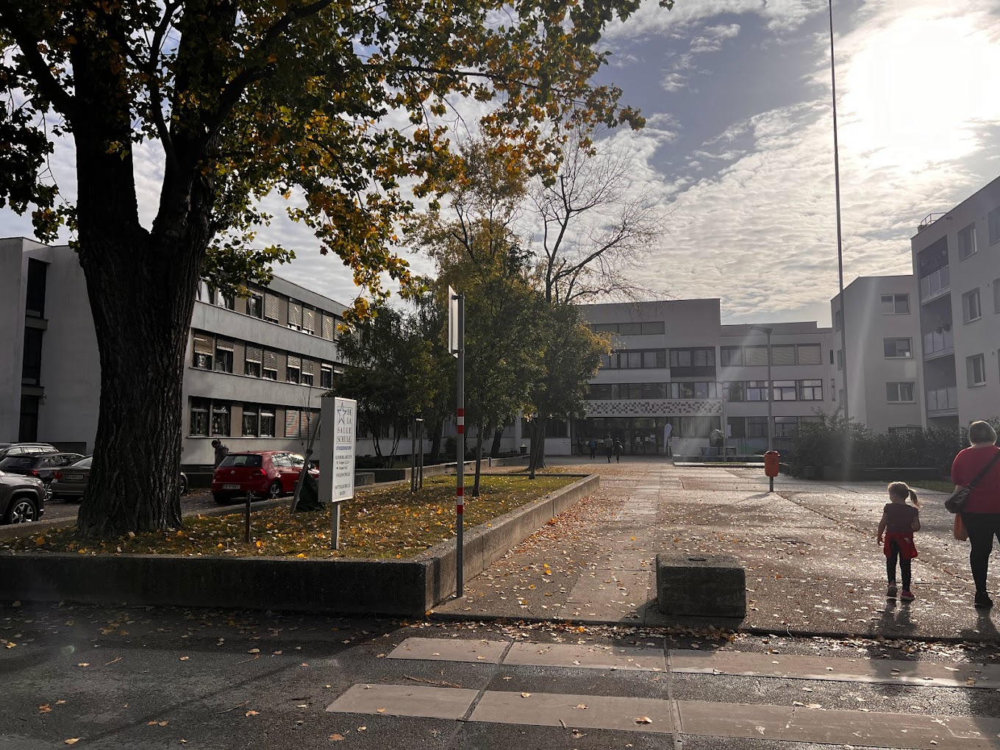

---
title: About | Balint Biro
layout: template
filename: index
--- 

<h2 class="main-title">About</h2>

    

        
    

    

        
Hi, my name is Balint Biro and welcome to my personal website!

        
This website is a reflection of my passions, interests, and experiences. I am a full-time Product Owner, currently living in Budapest with my beautiful girlfriend, Anna and our crazy black cat, Dante.

        
Through these pages, I'll be sharing a piece of my world and the stories that shape it.

        
Please also find me on:

        <a class="contact-option" href="mailto:birobalint95@gmail.com" style="margin-right: 16px;"><i class="fa fa-envelope"></i></a>
        <a class="contact-option" href="https://www.linkedin.com/in/balintbiro" style="margin-right: 16px;"><i class="fa fa-linkedin-square"></i></a>
        <a class="contact-option" href="https://www.facebook.com/biro95" style="margin-right: 16px;"><i class="fa fa-facebook-square"></i></a>
        <a class="contact-option" href="https://www.instagram.com/birobalint"><i class="fa fa-instagram"></i></a>
    

    <group id="group-of-details" style="position: -webkit-sticky; position: sticky; top: 90px; background-color: #232931; z-index: 99;">
        <a id="about-skills" class="detail-category selected" href="#" onclick="selectAboutDetailTab(this)">Skills</a>
        <a id="about-certifications" class="detail-category" href="#" onclick="selectAboutDetailTab(this)">Certifications</a>
        <a id="about-studies" class="detail-category" href="#" onclick="selectAboutDetailTab(this)">Studies</a>
        <a id="about-hobbies" class="detail-category" href="#" onclick="selectAboutDetailTab(this)">Hobbies</a>
    </group>
    

    

        
Languages

        <section id="language-skill-cards-section" class="skill-cards" style="color: black;"></section>
        
Methodologies and frameworks

        <section id="methodology-skill-cards-section" class="skill-cards" style="color: black;"></section>
        
Management and ownership

        <section id="management-skill-cards-section" class="skill-cards" style="color: black;"></section>
    

    

        <section id="certification-cards-section" class="certification-cards"></section>
    

    

        

            

                <ul class="list-of-studies">
                    <li class="study-item selected" ng-repeat="itembx">
                        <a id="university-degree-study" href="javascript:void(0)" onclick="getStudyDetails(this.id)">
                            
University degree

                            

                                University of Technology Budapest, Hungary
                            

                        </a>
                    </li>
                    <li class="study-item" ng-repeat="itembx">
                        <a id="language-learning-study" href="javascript:void(0)" onclick="getStudyDetails(this.id)">
                            
A year abroad

                            

                                De La Salle Gymnasium Vienna, Austria
                            

                        </a>
                    </li>
                    <li class="study-item" ng-repeat="itembx">
                        <a id="school-leaving-study" href="javascript:void(0)" onclick="getStudyDetails(this.id)">
                            
High school graduation

                            

                                Bolyai Janos High School Szombathely, Hungary
                            

                        </a>
                    </li>
                </ul>
            

        

        

            

                

                    <h2 class="study-title">University degree
                        2014 Sep - 2018 Jun
                    </h2>
                    <h4 class="study-location">University of Technology, Budapest, Hungary</h4>
                

                

                    

                        
My thesis was about designing a steering actuator for our driverless electric race car at BME Formula Racing Team. To achieve this, I went with the traditional waterfall method as it fit into the approach we have followed on vehicle level. This included the following actions:

                        <ul>
                            <li>Collecting requirements (regulations and team needs)</li>
                            <li>Benchmarking and literature research</li>
                            <li>Conceptual design creation</li>
                            <li>Calculations to validate the concept</li>
                            <li>Pre-design, choosing off-the-shelf products</li>
                            <li>Structural design creation</li>
                            <li>Manufacturing and ordering products</li>
                            <li>Assembling and testing</li>
                            <li>Suggestions for improvement, summary</li>
                        </ul>
                        
Downloadable links:
                            <a class="cv-download" title="download CV" id="download" href="static/pdfs/thesis.pdf" target="_blank" style="margin-left: 8px;">
                                <svg class="download-icon" width="13" height="16" viewBox="0 0 18 22" fill="none" xmlns="http://www.w3.org/2000/svg"><path class="download-arrow" d="M13 9L9 13M9 13L5 9M9 13V1" stroke-linecap="round" stroke-linejoin="round"></path><path d="M1 17V18C1 18.7956 1.31607 19.5587 1.87868 20.1213C2.44129 20.6839 3.20435 21 4 21H14C14.7956 21 15.5587 20.6839 16.1213 20.1213C16.6839 19.5587 17 18.7956 17 18V17" stroke-linecap="round" stroke-linejoin="round"></path></svg>
                                 Thesis
                            </a>
                            <a class="cv-download" title="download CV" id="download" href="static/pdfs/drawings.pdf" target="_blank" style="margin-left: 8px;">
                                <svg class="download-icon" width="13" height="16" viewBox="0 0 18 22" fill="none" xmlns="http://www.w3.org/2000/svg"><path class="download-arrow" d="M13 9L9 13M9 13L5 9M9 13V1" stroke-linecap="round" stroke-linejoin="round"></path><path d="M1 17V18C1 18.7956 1.31607 19.5587 1.87868 20.1213C2.44129 20.6839 3.20435 21 4 21H14C14.7956 21 15.5587 20.6839 16.1213 20.1213C16.6839 19.5587 17 18.7956 17 18V17" stroke-linecap="round" stroke-linejoin="round"></path></svg>
                                 Drawings
                            </a>
                            <a class="cv-download" title="download CV" id="download" href="static/pdfs/thesis_presentation.pdf" target="_blank" style="margin-left: 8px;">
                                <svg class="download-icon" width="13" height="16" viewBox="0 0 18 22" fill="none" xmlns="http://www.w3.org/2000/svg"><path class="download-arrow" d="M13 9L9 13M9 13L5 9M9 13V1" stroke-linecap="round" stroke-linejoin="round"></path><path d="M1 17V18C1 18.7956 1.31607 19.5587 1.87868 20.1213C2.44129 20.6839 3.20435 21 4 21H14C14.7956 21 15.5587 20.6839 16.1213 20.1213C16.6839 19.5587 17 18.7956 17 18V17" stroke-linecap="round" stroke-linejoin="round"></path></svg>
                                 Presentation
                            </a>
                        

                        
Please forgive me that they are written only in Hungarian.

                        
                    

                

            

            

                

                    <h2 class="study-title">A year abroad
                        2012 Sep - 2013 Sep
                    </h2>
                    <h4 class="study-location">De La Salle Gymnasium, Vienna, Austria</h4>
                

                

                    

                        
In the 3rd year of high school, I have spent 1 year studying in <a class='clickable-inline-link' href='https://ahs.dls21.at/de/' target='_blank'>De La Salle Gymnasium, Vienna</a>. The main goal was to learn the German language and once I come back home, pass the German B2 language exam which I successfully achieved.

                        
Although in the beginning it was difficult to be away from my family and friends, and to attend all the foreign language classes but after a while I got use to it and it was a pleasure to meet and make friends with people from different countries. I believe it was a great challenge and was totally worth it to get out of my comfort zone.

                        
To not lose a year in my Hungarian studies, I did learn for my Hungarian subjects as well and occasionally went back to my Hungarian high school and took the exams that enabled me to continue my studies in the final (4th) year with my original class.

                        
                    

                

            

            

                

                    <h2 class="study-title">High school graduation
                        2002 Sep - 2014 Jun
                    </h2>
                    <h4 class="study-location">Bolyai Janos School, Szombathely, Hungary</h4>
                

                

                    

                        
I was born and raised in Szombathely which is almost in the westernmost part of Hungary, near to the Austrian border. I have spent 12 years studying in <a class='clickable-inline-link' href='http://www.bolyaigimnazium.elte.hu/' target='_blank'>Bolyai Janos School</a> as it is both an elementary and a high school.

                        
In the last 2 years, I had to choose my faculties which happened to be maths and physics due to the fact that my goal was to admit to the Technical University of Budapest and to become a mechanical engineer. As maths was my favourite subject, I graduated from that on an advanced level and the other subjects on an intermediate level.

                        
As I loved (and still love) swimming and playing waterpolo, I also represented the school in such competitions which for I gained some additional points for my university admission.

                        
                    

                

            

        

    

    

        <section id="hobby-cards-section" class="hobby-cards"></section>
    

